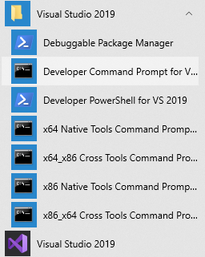

# Building Swift on Windows

Visual Studio 2017 or newer is needed to build swift on Windows. The following must take place in the developer command prompt (provided by Visual Studio). This shows up as "x64 Native Tools Command Prompt for VS2017" (or VS2019, VS2019 Preview depending on the Visual Studio that you are using) in the Start Menu.

## Install dependencies

- Install the latest version of [Visual Studio](https://www.visualstudio.com/downloads/)
- Make sure to include "Programming Languages|Visual C++" and "Windows and Web Development|Universal Windows App Development|Windows SDK" in your installation. The following components are required ([Find the name of components given its ID](https://docs.microsoft.com/fr-fr/visualstudio/install/workload-component-id-vs-build-tools?view=vs-2019)):

1. Microsoft.VisualStudio.Component.Windows10SDK (Windows Universal C Runtime)
1. Microsoft.VisualStudio.Component.Windows10SDK.17763 (Windows 10 SDK (version))
1. Microsoft.VisualStudio.Component.VC.Tools.x86.x64 (MSVC vXXX - VS 20XX C++ x64/x86 build tools)

## Clone the repositories

1. Clone `apple/llvm-project` into a directory for the toolchain
2. Clone `apple/swift-cmark`, `apple/swift`, `apple/swift-corelibs-libdispatch`, `apple/swift-corelibs-foundation`, `apple/swift-corelibs-xctest`, `apple/swift-llbuild`, `apple/swift-package-manager` into the toolchain directory
3. Clone `compnerd/windows-swift` as a peer of the toolchain directory

- Currently, other repositories in the Swift project have not been tested and may not be supported.

This guide assumes your sources live at the root of `S:`. If your sources live elsewhere, you can create a substitution for this:

```cmd
subst S: <path to sources>
```

```cmd
S:
git clone https://github.com/apple/llvm-project --branch swift/master toolchain
git clone -c core.autocrlf=input -c core.symlinks=true https://github.com/apple/swift toolchain/swift
git clone https://github.com/apple/swift-cmark toolchain/cmark
git clone https://github.com/apple/swift-corelibs-libdispatch toolchain/swift-corelibs-libdispatch
git clone https://github.com/apple/swift-corelibs-foundation toolchain/swift-corelibs-foundation
git clone https://github.com/apple/swift-corelibs-xctest toolchain/swift-corelibs-xctest
git clone https://github.com/apple/swift-llbuild toolchain/llbuild
git clone -c core.autocrlf=input https://github.com/apple/swift-package-manager toolchain/swift-package-manager
git clone https://github.com/compnerd/windows-swift windows-swift
```

## Acquire ICU, SQLite3, curl, libxml2, zlib

Go to [compnerd's windows-swift azure page](https://dev.azure.com/compnerd/windows-swift/_build) and open [Pipelines](https://dev.azure.com/compnerd/windows-swift/_build) where you'll see bots (hopefully green) for:

- [ICU](https://dev.azure.com/compnerd/windows-swift/_build?definitionId=9)
- [SQLite](https://dev.azure.com/compnerd/windows-swift/_build?definitionId=12&_a=summary)
- [curl](https://dev.azure.com/compnerd/windows-swift/_build?definitionId=11&_a=summary)
- [libxml2](https://dev.azure.com/compnerd/windows-swift/_build?definitionId=10&_a=summary)
- [zlib](https://dev.azure.com/compnerd/windows-swift/_build?definitionId=16&_a=summary)

Download each of the zip files and copy their contents into S:/Library. The directory structure should resemble:

```
/Library
  ┝ icu-64
  │   ┕ usr/...
  ├ libcurl-development
  │   ┕ usr/...
  ├ libxml2-development
  │   ┕ usr/...
  ├ sqlite-3.28.0
  │   ┕ usr/...
  ┕ zlib-1.2.11
      ┕ usr/...
```

## One-time Setup (re-run on Visual Studio upgrades)

- The commands above require to use the Visual Studio Developer Command prompt



- Set up the `ucrt`, `visualc`, and `WinSDK` modules by copying `ucrt.modulemap` located at
  `swift/stdlib/public/Platform/ucrt.modulemap` into
  `${UniversalCRTSdkDir}/Include/${UCRTVersion}/ucrt` as `module.modulemap`, copying `visualc.modulemap` located at `swift/stdlib/public/Platform/visualc.modulemap` into `${VCToolsInstallDir}/include` as `module.modulemap`, and copying `winsdk.modulemap` located at `swift/stdlib/public/Platform/winsdk.modulemap` into `${UniversalCRTSdkDir}/Include/${UCRTVersion}/um` and setup the `visualc.apinotes` located at `swift/stdlib/public/Platform/visualc.apinotes` into `${VCToolsInstallDir}/include` as `visualc.apinotes`

```cmd
mklink "%UniversalCRTSdkDir%\Include\%UCRTVersion%\ucrt\module.modulemap" S:\toolchain\swift\stdlib\public\Platform\ucrt.modulemap
mklink "%UniversalCRTSdkDir%\Include\%UCRTVersion%\um\module.modulemap" S:\toolchain\swift\stdlib\public\Platform\winsdk.modulemap
mklink "%VCToolsInstallDir%\include\module.modulemap" S:\toolchain\swift\stdlib\public\Platform\visualc.modulemap
mklink "%VCToolsInstallDir%\include\visualc.apinotes" S:\toolchain\swift\stdlib\public\Platform\visualc.apinotes
```

Warning: Creating the above links usually requires administrator privileges. The quick and easy way to do this is to open a second developer prompt by right clicking whatever shortcut you used to open the first one, choosing Run As Administrator, and pasting the above commands into the resulting window. You can then close the privileged prompt; this is the only step which requires elevation.

## Build the toolchain

```cmd
md "S:\b\toolchain"
set PYTHON_EXE=(your python.exe full path)
set INSTALL_PREFIX=C:\Library\Developer\Toolchains\unknown-Asserts-development.xctoolchain\usr
cmake -B "S:\b\toolchain" -G Ninja -S S:\toolchain\llvm -C S:\windows-swift\cmake\caches\Windows-x86_64.cmake -C S:\windows-swift\cmake\caches\org.compnerd.dt.cmake -DLLVM_ENABLE_ASSERTIONS=YES -DLLVM_ENABLE_PROJECTS="clang;clang-tools-extra;cmark;swift;lldb;lld" -DLLVM_EXTERNAL_PROJECTS="cmark;swift" -DSWIFT_PATH_TO_LIBDISPATCH_SOURCE=S:\toolchain\swift-corelibs-libdispatch -DLLVM_ENABLE_PDB=YES -DLLDB_DISABLE_PYTHON=YES -DSWIFT_WINDOWS_x86_64_ICU_UC_INCLUDE="S:/Library/icu-64/usr/include" -DSWIFT_WINDOWS_x86_64_ICU_UC="S:/Library/icu-64/usr/lib/icuuc64.lib" -DSWIFT_WINDOWS_x86_64_ICU_I18N_INCLUDE="S:/Library/icu-64/usr/include" -DSWIFT_WINDOWS_x86_64_ICU_I18N="S:/Library/icu-64/usr/lib/icuin64.lib" -DCMAKE_INSTALL_PREFIX=%INSTALL_PREFIX% -DPYTHON_EXECUTABLE=%PYTHON_EXE% -DSWIFT_BUILD_DYNAMIC_STDLIB=YES -DSWIFT_BUILD_DYNAMIC_SDK_OVERLAY=YES
ninja -C S:\b\toolchain
```

## Running Swift tests on Windows

```cmd
path S:\Library\icu-64\usr\bin;S:\b\toolchain\bin;S:\b\toolchain\libdispatch-prefix\bin;%PATH%;%ProgramFiles%\Git\usr\bin
ninja -C S:\b\toolchain check-swift
```

## Build swift-corelibs-libdispatch

```cmd
cmake -B S:\b\libdispatch -G Ninja -S S:\toolchain\swift-corelibs-libdispatch -DCMAKE_BUILD_TYPE=RelWithDebInfo -DCMAKE_C_COMPILER=S:/b/toolchain/bin/clang-cl.exe -DCMAKE_CXX_COMPILER=S:/b/toolchain/bin/clang-cl.exe -DCMAKE_Swift_COMPILER=S:/b/toolchain/bin/swiftc.exe -DENABLE_SWIFT=YES
ninja -C S:\b\libdispatch
```

## Test swift-corelibs-libdispatch

```cmd
ninja -C S:\b\libdispatch check
```

## Build swift-corelibs-foundation

```cmd
cmake -B S:\b\foundation -G Ninja -S S:\toolchain\swift-corelibs-foundation -DCMAKE_BUILD_TYPE=RelWithDebInfo -DCMAKE_C_COMPILER=S:/b/toolchain/clang-cl.exe -DCMAKE_Swift_COMPILER=S:/b/toolchain/bin/swiftc.exe -DCURL_LIBRARY="S:/Library/libcurl-development/usr/lib/libcurl.lib" -DCURL_INCLUDE_DIR="S:/Library/libcurl-development/usr/include" -DICU_ROOT="S:/Library/icu-64" -DICU_INCLUDE_DIR=S:/Library/icu-64/usr/include -DLIBXML2_LIBRARY="S:/Library/libxml2-development/usr/lib/libxml2s.lib" -DLIBXML2_INCLUDE_DIR="S:/Library/libxml2-development/usr/include/libxml2" -DENABLE_TESTING=NO -Ddispatch_DIR=S:/b/libdispatch/cmake/modules
ninja -C S:\b\foundation
```

- Add Foundation to your path:

```cmd
path S:\b\foundation\Foundation;%PATH%
```

## Build swift-corelibs-xctest

```cmd
cmake -B S:\b\xctest -G Ninja -S S:\toolchain\swift-corelibs-xctest -DCMAKE_BUILD_TYPE=RelWithDebInfo -DCMAKE_Swift_COMPILER=S:/b/toolchain/bin/swiftc.exe -Ddispatch_DIR=S:\b\dispatch\cmake\modules -DFoundation_DIR=S:\b\foundation\cmake\modules -DLIT_COMMAND=S:\toolchain\llvm\utils\lit\lit.py -DPYTHON_EXECUTABLE=C:\Python27\python.exe
ninja -C S:\b\xctest
```

- Add XCTest to your path:

```cmd
path S:\b\xctest;%PATH%
```

## Test XCTest

```cmd
ninja -C S:\b\xctest check-xctest
```

## Rebuild Foundation

```cmd
cmake -B S:\b\foundation -G Ninja -S S:\toolchain\swift-corelibs-foundation -DCMAKE_BUILD_TYPE=RelWithDebInfo -DCMAKE_C_COMPILER=S:/b/toolchain/bin/clang-cl.exe -DCMAKE_Swift_COMPILER=S:/b/toolchain/bin/swiftc.exe -DCURL_LIBRARY="S:/Library/libcurl-development/usr/lib/libcurl.lib" -DCURL_INCLUDE_DIR="S:/Library/libcurl-development/usr/include" -DICU_ROOT="S:/Library/icu-64" -DLIBXML2_LIBRARY="S:/Library/libxml2-development/usr/lib/libxml2.lib" -DLIBXML2_INCLUDE_DIR="S:/Library/libxml2-development/usr/include" -DENABLE_TESTING=YES -Ddisptch_DIR=S:/b/libdispatch/cmake/modules -DXCTest_DIR=S:/b/xctest/cmake/modules
ninja -C S:\b\foundation
```

## Test Foundation

```cmd
cmake --build S:\b\foundation
ninja -C S:\b\foundation test
```

## Build llbuild

```cmd
set AR=llvm-ar
cmake -B S:\b\llbuild -G Ninja -S S:\toolchain\llbuild -DCMAKE_BUILD_TYPE=RelWithDebInfo -DCMAKE_CXX_COMPILER=cl -DCMAKE_Swift_COMPILER=S:/b/toolchain/bin/swiftc.exe -DFoundation_DIR=S:/b/foundation/cmake/modules -Ddispatch_DIR=S:/b/libdispatch/cmake/modules -DSQLite3_INCLUDE_DIR=S:\Library\sqlite-3.28.0\usr\include -DSQLite3_LIBRARY=S:\Library\sqlite-3.28.0\usr\lib\sqlite3.lib -DLLBUILD_SUPPORT_BINDINGS=Swift
ninja -C S:\b\llbuild
```

- Add llbuild to your path:

```cmd
path S:\b\llbuild\bin;%PATH%
```

## Build swift-tools-core-support

```cmd
md S:\b\tsc
cmake -B S:\b\tsc -G Ninja -S S:\toolchain\swift-tools-support-core -DCMAKE_BUILD_TYPE=RelWithDebInfo -DCMAKE_C_COMPILER=cl -DCMAKE_Swift_COMPILER=S:/b/toolchain/bin/swiftc.exe -DFoundation_DIR=S:/b/foundation/cmake/modules -Ddispatch_DIR=S:/b/libdispatch/cmake/modules
ninja -C S:\b\tsc
```

## Build swift-package-manager

```cmd
md S:\b\spm
cd S:\b\spm
C:\Python27\python.exe S:\swift-package-manager\Utilities\bootstrap --foundation S:\b\foundation --libdispatch-build-dir S:\b\libdispatch --libdispatch-source-dir S:\swift-corelibs-libdispatch --llbuild-build-dir S:\b\llbuild --llbuild-source-dir S:\llbuild --sqlite-build-dir S:\b\sqlite --sqlite-source-dir S:\sqlite-amalgamation-3270200
```

## Install the Swift toolchain on Windows

- Run ninja install:

```cmd
ninja -C S:\b\toolchain install
```

- Add the Swift on Windows binaries path (`C:\Library\Developer\Toolchains\unknown-Asserts-development.xctoolchain\usr\bin`) to the `PATH` environment variable.
